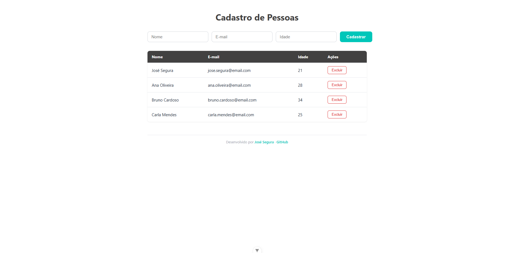
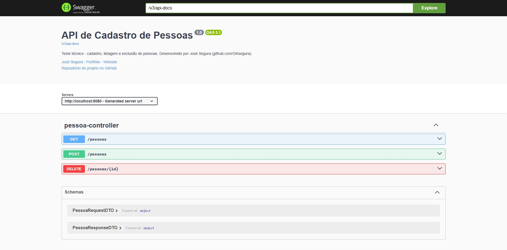
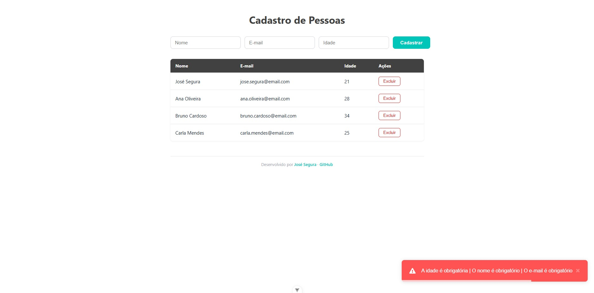

# Teste Técnico - Cadastro de Pessoas

Aplicação full-stack para cadastro, listagem e exclusão de pessoas, desenvolvida
como teste técnico para a vaga de Desenvolvedor Júnior (Java + Vue.js).



## Stack

**Backend**

- Java 25 (Temurin) · Spring Boot 4.1.0 · Maven
- Spring Web · Spring Data JPA · Bean Validation
- MySQL · Swagger (springdoc-openapi)

**Frontend**

- Vue 3 (Composition API) · Vite
- Axios · vue-toastification

## Pré-requisitos

- Java 21+ (desenvolvido com Java 25)
- Node.js 18+
- MySQL rodando em `localhost:3306`

## Como executar

### 1. Backend

Ajuste usuário e senha do MySQL em `src/main/resources/application.properties`
(o database `cadastro_pessoas` é criado automaticamente na primeira execução):

```properties
spring.datasource.username=root
spring.datasource.password=SUA_SENHA
```

Na raiz do projeto:

```bash
./mvnw spring-boot:run
```

A API sobe em `http://localhost:8080`.
Documentação interativa (Swagger): **http://localhost:8080/swagger-ui.html**

### 2. Frontend

```bash
cd frontend
npm install
npm run dev
```

A aplicação abre em `http://localhost:5173`.

## Endpoints

| Método | Rota            | Descrição           | Sucesso | Erros                |
| ------ | --------------- | ------------------- | ------- | -------------------- |
| POST   | `/pessoas`      | Cadastra uma pessoa | 201     | 400 (validação)      |
| GET    | `/pessoas`      | Lista as pessoas    | 200     | -                    |
| DELETE | `/pessoas/{id}` | Exclui uma pessoa   | 204     | 404 (id inexistente) |



Validações (Bean Validation no DTO): nome obrigatório, e-mail obrigatório e
válido, idade obrigatória e maior que zero. Erros de validação retornam
`400` com um mapa `campo → mensagem`; id inexistente retorna `404` com
mensagem clara - ambos tratados por um handler global (`@RestControllerAdvice`).



## Funcionalidades

- ✅ Cadastrar pessoa (com validação em duas camadas: frontend e backend)
- ✅ Listar pessoas cadastradas
- ✅ Excluir pessoa com confirmação prévia
- ✅ Mensagem de sucesso no cadastro (toast)
- ✅ Feedback de erro com as mensagens reais da API (toast)

## Decisões técnicas

- **Arquitetura em camadas** (`entities`, `repositories`, `dtos`, `services`,
  `controllers`, `exceptions`, `config`): responsabilidade única por camada,
  código testável e fácil de evoluir.
- **DTOs (records) em vez de expor entities**: controlam o contrato da API,
  desacoplam REST do modelo do banco e concentram as validações de entrada.
- **Handler global de exceções**: respostas de erro consistentes (400 com mapa
  de mensagens, 404 com descrição) sem try-catch espalhado pelos controllers.
- **Banco como única fonte de verdade no frontend**: após cadastrar/excluir,
  a lista é recarregada do servidor em vez de atualizada localmente -
  simplicidade e consistência para o escopo.
- **Chamadas HTTP centralizadas** em um service (`pessoaService.js`) com
  `baseURL` única, fora dos componentes.
- **vue-toastification para os toasts**: avaliei implementar manualmente
  (ref + v-if + setTimeout) e optei pela biblioteca por maturidade
  (empilhamento, acessibilidade, pausa no hover).
- **Componente único no frontend**: pela escala do desafio (uma tela);
  em um app maior, extrairia `PessoaForm` e `PessoaTabela` comunicando
  por props/emits.
- **Identidade visual**: paleta baseada nas cores da Nexum
  (teal `#00C6B9` e grafite `#424141`).

## Possíveis evoluções

- Edição de registros (`PUT /pessoas/{id}`)
- Testes unitários no service (JUnit + Mockito)
- Paginação na listagem
- Componentização do frontend (PessoaForm / PessoaTabela)
- Modal de confirmação customizado no lugar do `confirm()` nativo

---

Desenvolvido por **[José Segura](https://gksegura.netlify.app)** ·
[GitHub](https://github.com/GKsegura)
